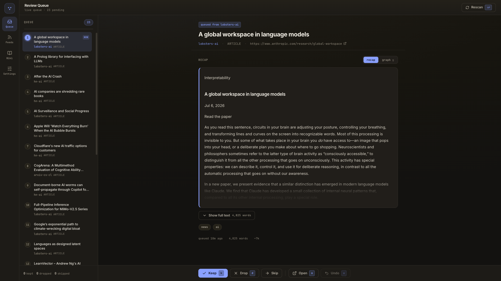
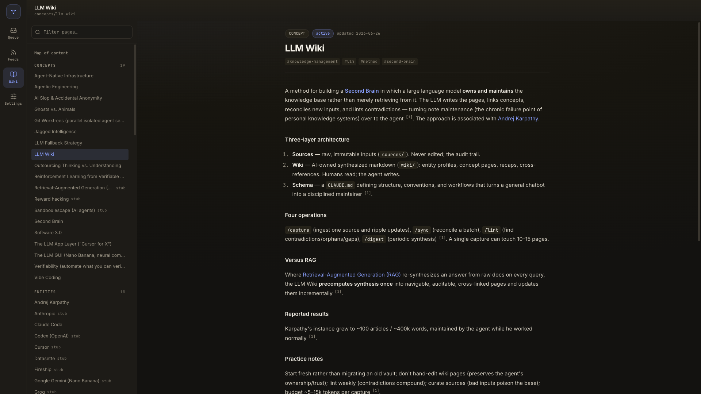
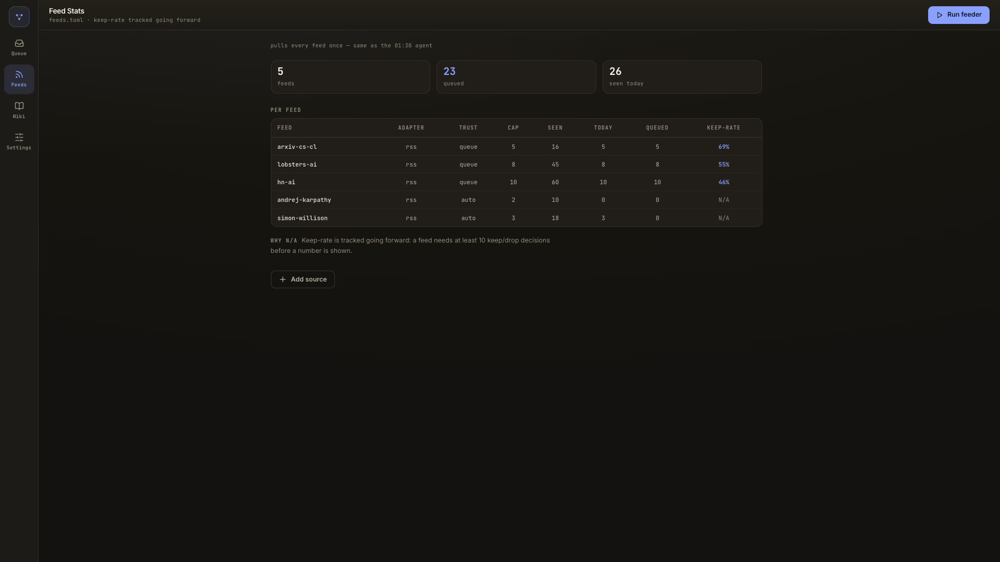
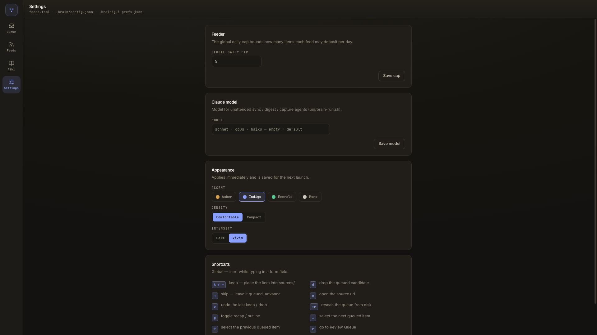

# Second Brain — an LLM-maintained wiki

An AI-owned knowledge base, built on the **LLM Wiki** method (Karpathy's approach,
[writeup](https://www.askglitch.com/blog/build-a-second-brain)). The idea: don't use an
LLM to *query* your notes — let it **own and maintain** the wiki. It writes the pages,
links the concepts, reconciles new sources, and lints contradictions. You add raw
sources and read the result.

## Why not just RAG?

RAG re-synthesizes an answer from raw documents on every query. This precomputes the
synthesis **once** into human-readable, cross-linked, auditable pages — then keeps them
updated as new sources arrive. The knowledge is a navigable artifact, not a transient
answer.

## The three layers

```
second-brain/
├── CLAUDE.md          # Layer 3: the schema — rules, conventions, workflows (the agent's constitution)
├── log.md             # Layer 3: append-only operations log
├── index.md           # the human entry point — map of content
├── sources/           # Layer 1: raw, IMMUTABLE inputs (never edited)
└── wiki/              # Layer 2: AI-owned synthesis (you read, you don't hand-write)
    ├── entities/      #   people, orgs, products, tools, places
    ├── concepts/      #   ideas, methods, theories, themes
    ├── recaps/        #   one faithful summary per source
    └── digests/       #   periodic syntheses
```

## The operations (Claude Code skills in `.claude/skills/`)

| Command | What it does |
|---|---|
| `/capture <url \| file \| pasted text>` | Ingest one source → store raw → recap → update every affected wiki page. |
| `/remember [focus]` | Distil the current conversation with Claude into a new source, then fold it into the wiki. |
| `/sync` | Reconcile a batch of new sources in one coherent pass. |
| `/lint` | Find contradictions, orphans, dangling links, missing citations, stale pages. Run weekly. |
| `/digest` | Synthesize recent activity into a dated digest: themes, patterns, open questions. |

## The web app

`bin/brain-web.sh` opens the brain in a browser — FastAPI on `:8787`, Vite on `:5173`,
both over this same vault on disk (needs `pnpm install` and a `.venv`; see *Getting
started*). Four sections live on a persistent left rail, every screen is keyboard-driven
(`r` queue · `f` feeds · `w` wiki · `s` settings), and the layout is responsive down to a
phone: the rail collapses to a drawer and the contextual lists become slide-overs.

It reads and triages; it never synthesizes. Nothing here writes a wiki page — that stays
the agent's job, so anything you keep waits for the next `/sync`.

**Review Queue** — the `brain-feed review` triage as a screen. Queue on the left, the
selected item's recap on the right (`g` swaps to its outline), and Keep (`k` → `sources/`)
/ Drop (`d`) / Skip (`→`) / Open (`o`) / Undo (`u`) as an action bar.



**Wiki** — the synthesized layer, read-only. The page tree is filterable; `[[wikilinks]]`
resolve to page titles, `[source-id]` citations render as numbered superscripts that link
through to the raw source.



**Feeds** — per-feed state from `feeds.toml` (adapter, trust, cap, seen, queued,
keep-rate), a **Run feeder** button that fires the same pull as the 01:30 agent, and an
**Add source** form. Keep-rate stays `N/A` until a feed has 10 keep/drop decisions.



**Settings** — the feeder's global daily cap (written back to `feeds.toml`), the model the
unattended agents run on (`.brain/config.json`), appearance prefs, and a shortcuts card.



## Running on a schedule (macOS)

The brain maintains itself unattended via launchd — drop sources in, read the wiki
later. `bin/brain-schedule.sh install` loads two LaunchAgents that run `claude`
headlessly in this vault:

- **nightly 02:00** → a deterministic `tidy --fix` pass, then `/sync` to reconcile new
  sources — but Claude is invoked only when there's a backlog, so an empty night spends no
  tokens (`docs/adr/0001`),
- **Mondays 09:00** → `/digest` writes the weekly synthesis.

Unattended runs **never write to `main`**. Each one validates its output, then opens a
pull request (`brain/sync-…` / `brain/digest-…`) for you to review and merge — so you
always read the synthesized content before it lands. If validation fails, the edits are
left uncommitted and the failure is logged instead of pushed. Merge these PRs promptly:
a source stays "unprocessed" until its recap is on `main`, so an unmerged sync PR will
be reconciled again on the next run.

Plists live in `bin/launchd/` (symlinked into `~/Library/LaunchAgents/`); every run is
logged to `.brain/cron.log`. Check state with `bin/brain-schedule.sh status`, fire one
now with `bin/brain-schedule.sh run sync`, or remove them with `… uninstall`.

## Local tooling (`bin/`)

Deterministic helpers — no LLM, no tokens — that surround the agent:

- **Validate / tidy** — `bin/brain-validate.sh` checks every page against the
  `CLAUDE.md` schema (frontmatter, kebab-case slugs, citations); `bin/brain_tidy.py
  --fix` applies the safe fixes. `… --install-hook` adds a pre-commit guard so broken
  pages can't be committed.
- **Capture from anywhere (push)** — `bin/brain-clip.sh <url | file | text>` lands raw
  material into `sources/` with valid frontmatter. A YouTube/Vimeo URL is recognized and
  deposited as its **captions transcript** (`type: transcript`) via `yt-dlp` instead of
  the useless player-page HTML — so any path that hands the clipper a URL (the watch
  folder, the `list` feed, a share-sheet) can capture a video by link. Without `yt-dlp`
  installed it warns and falls back to page extraction. `bin/brain-clip-gui.sh install`
  deploys four more surfaces on top of the CLI: a double-clickable **Clip to Brain.app**,
  a watched **inbox folder** (`~/Brain Inbox`, ingested on drop by
  `bin/brain-clip-watch.sh`), a right-click **Services → Clip to Brain** Quick Action,
  and a **Chrome toolbar button** (posts the current tab to a localhost helper; on a
  video tab it relabels to "Clip transcript"). All of them end at the same clipper, so
  everything lands contract-valid.
- **Subscribe to feeds (pull)** — `bin/brain-feed.sh run` polls the feeds in `feeds.toml`
  through five adapters — RSS/Atom, a to-read list, YouTube, an email label, and **`api`**
  (any public JSON HTTP endpoint, mapped to items by a declarative block in `feeds.toml`:
  `items_path` plus which field is the `url`/`title`/`guid`/`body`, so a new API is a
  config edit, not new Python) — and deposits new items into `sources/` (trusted feeds) or
  `.brain/review/` (queued — triage with `brain-feed review`). A per-feed daily cap stops
  any feed flooding the brain. Reuses the clipper's deposit, so the nightly `/sync` folds
  the result in. Opt-in daily 01:30 schedule via `bin/brain-feed-schedule.sh install`.
  The poll loop stays deterministic and model-free by design: for an `api` feed *you*
  author the mapping once in a Claude session from a sample response and validate it with
  `bin/brain-feed.sh run --dry-run --feed <id>` — the unattended feeder never calls a model
  (`docs/adr/0002`).
- **Triage in a window** — `bin/brain-feed-gui.sh` opens a native macOS (Tkinter)
  desktop app over the same feeder, with three screens on a tab bar (`r` / `f` / `s`):
  - **Review Queue** — the `brain-feed review` triage as a window: the queue on the
    left (drag to reorder), the selected item's recap or outline on the right (`g`
    toggles), and Keep (`k`/⏎ → `sources/`) / Drop (`d`) / Skip (`→`) / Open (`o`) /
    Undo (`u`) as an action bar.
  - **Feed Stats** — a **Run feeder now** button that fires `brain-feed run` in the
    background (the same pull the 01:30 agent does) and reports the run's summary,
    above a read-only per-feed table (seen / today / queued / keep-rate), plus a
    **New source** form: *webpage* clips a URL or note straight into `sources/`,
    while *rss/api* appends a subscription block to `feeds.toml` (trust, cap, tags, and
    the declarative mapping fields for `api`) for the next feeder run.
  - **Settings** — the feeder's global daily cap (written back into `feeds.toml`),
    appearance options (persisted to gitignored `.brain/gui-prefs.json`), and a
    shortcuts reference card.

  It's a thin shell over `brain-feed.py` — keep/drop placement and feed subscription
  reuse the CLI's logic verbatim, so behaviour stays single-source, and like the CLI it
  does no synthesis: kept items wait for the nightly `/sync`. `--demo` seeds three
  showcase items with no filesystem writes. Needs Tk (`brew install python-tk@3.14`).
  [The web app](#the-web-app) covers the same three screens in a browser, plus the wiki;
  both remain functional and share the same feeder and files.
- **Read the wiki in a browser** — `bin/brain-serve.sh [port]` renders `wiki/` and
  `index.md` read-only, resolving wikilinks, citations, and backlinks, and surfacing
  stubs and dangling links. Zero install: stdlib Python, no build step. For the fuller
  surface — triage, feeds and settings alongside the wiki — see [the web
  app](#the-web-app).

## Getting started

1. Open this folder in Claude Code.
2. Run `/capture <a url or file>` to add your first source. Watch the wiki populate.
3. Run `/lint` to see structural health, `/digest` for a synthesis.
4. Read the wiki via `index.md`, or in the browser:

   ```sh
   pnpm install
   python3 -m venv .venv && .venv/bin/pip install fastapi 'uvicorn[standard]' httpx pytest
   bin/brain-web.sh            # → http://localhost:5173
   ```

## Use it well (gotchas from the article)

- **Don't bulk-migrate an old vault.** Start fresh; let the brain grow source by source.
- **Don't hand-edit wiki pages.** Let the agent own `wiki/` — that's what keeps it
  coherent and trustworthy. Add knowledge as *sources* instead.
- **Sources are immutable.** Corrections go in the wiki (cited), never by editing
  `sources/`.
- **Curate inputs.** Bad sources poison the brain. Capture deliberately.
- **Lint weekly, minimum.** Contradictions compound.
- **Budget tokens** (~5–15k per `/capture`).

## Tailoring

`CLAUDE.md` is domain-agnostic out of the box. Tell the agent your domain (a research
field, a company, personal finance, a course) and it will adapt the taxonomy, tags, and
extraction rules in `CLAUDE.md` and the skills.
